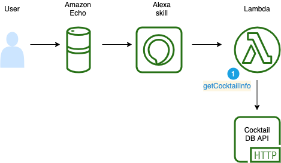

# Cocktail Maker

Cocktail Maker is an Alexa skill that will let you find out how to make popular cocktails. It uses the [Cocktail DB API](https://www.thecocktaildb.com/) as the back-end service. The popular [Rapid API](https://rapidapi.com/thecocktaildb/api/the-cocktail-db) framework is used to access Cocktail DB API.

## Usage

The Cocktail Maker skill works by being activated like this:

U: Alexa, open Cocktail Maker.
A. Hi! What cocktail would you like to make?

U. How do you make a margarita?
A. OK, you need: Tequila, Triple sec, Lime juice, and Salt. Rub the rim of the glass with the lime slice to make the salt stick to it. Take care to moisten only the outer rim and sprinkle the salt on it. The salt should present to the lips of the imbiber and never mix into the cocktail. Shake the other ingredients with ice, then carefully pour into the glass.

## Skill Configuration

Currently it uses an Alexa hosted skill with the following details:

* Skill Name: Cocktail Maker
* Invocation Name: `cocktail maker`
* *Alexa Skill ID: `amzn1.ask.skill.7337c451-d15b-4a32-a47c-b1fdc3706eca`.



### Rapid API Key

A Rapid API key is required to for access to Cocktail DB API. You can sign up for a key from: https://rapidapi.com/thecocktaildb/api/the-cocktail-db. The key needs to go into the `config.json` file in the `lambda` directory. It should have read-access permissions only.

## Testing Locally

You can use the Amazon Alexa `ask` tool to setup a test interactive session from your local environment like this:

```bash
ask dialog
```

Then initiate a conversation like this:

```bash
User  > Alexa, open Cocktail Maker.
Alexa > Hi! What cocktail would you like to make?
User  > Tell me how to make a Long Island Tea.
Alexa > OK, you need: Vodka, Light rum, Gin, Tequila, Lemon, and Coca-Cola. Combine all ingredients (except cola) and pour over ice in a highball glass. Add the splash of cola for color. Decorate with a slice of lemon and serve.
```

See the [ASK CLI](https://developer.amazon.com/en-US/docs/alexa/smapi/ask-cli-intro.html#test-locally) docs for more info.

## Deployment to Amazon

To deploy to the Amazon Alexa hosted (development) environment you simply do a `git push` to of your master branch. You can then test the status of the skill like this:

```bash
ask smapi get-skill-status -s amzn1.ask.skill.7337c451-d15b-4a32-a47c-b1fdc3706eca
```
